**실무 프로젝트 기획안** 

**2020년 8월 28일**

**과정명** : **빅데이터를 활용한** **IoT** **시스템 개발**

 

| **팀 명**                                                    | 4조                                                          |
| ------------------------------------------------------------ | ------------------------------------------------------------ |
| **팀 원**                                                    | 김수비, **안기훈**, 전민찬                                   |
| **프로젝트 타이틀**                                          | **M  MART**                                                  |
| **프로젝트 주제    및 내용**  해결하고자 하는 문제   최종 산출물의 청사진 | 집 앞이라도 비가 오거나, 날이 덥거나  혹은 그냥 밖으로 나가기 싫어 편의점에서 배달시키고 싶은 경우가 많았습니다.  따라서, 고객이 원하는 물건을 요청하고 관리자가 추가하며 소통이 자유로운 온라인 마트 웹 애플리케이션을 개발하고  싶었습니다.  고객에게 가격과 재고, 예상 시간과 포인트 기능을 통한 혜택을 제공하고 원활한 소통을 통해 기존 B마트보다 소비자 친화적인 어플을 제공하려 합니다.  관리자는 고객의 정보와 재고 현황을  관리할 수 있으며, 가게 운영 시간이나 휴무, 쿠폰, 이벤트 등을 관리할 수 있습니다.  또한 기상 상황이나 배달 상황 등을  고려하여 예상 배달시간을 설정할 수 있습니다. |
| **팀원간 역할**   **분담 및 일정**                           | DataBase  – Oracle  HTML/CSS/JavaScript Spring  Framework 기본 설정   Spring  Framework DB연결 |
| **프로젝트 수행 방향**  수행 방법/도구                       | JSP를 이용해 동적 HTML 구현 SPRING  FRAMEWORK를 이용해 고객의 정보나 재고 등 DataBase를 관리하며, Admin page에서 차트를 이용해  지점별, 항목별 판매량을 쉽게 볼 수 있도록 화면 구현  Admin  page에서 고객 정보와 메뉴 속성을 관리할 수 있도록  함  가게 운영 정보(OPEN, CLOSE)를 나타낼 수 있음 고객도 my page에서 자신의 정보와 프로필 사진을 수정하거나 계정을 삭제하는 기능을 구현 API를 이용해 고객과의 거리를 계산해 배달까지의 예상 시간을 전달 고객이 장바구니를 이용해 주문하고자  하는 메뉴를 담아둘 수 있도록 구현 고객이 포인트를 적립하고 사용할 수  있음 고객이 관리자에게 메시지를 보내는 기능을  구현 원하는 물건을 추가 요청하는 기능 추가 |

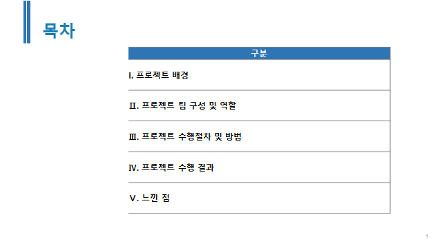

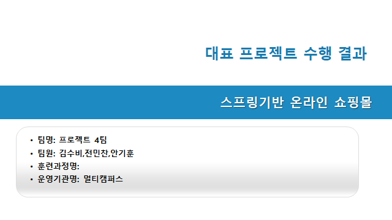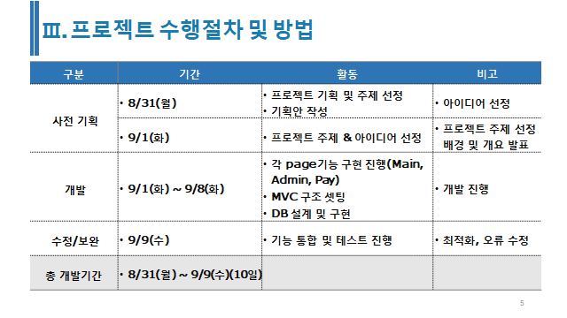

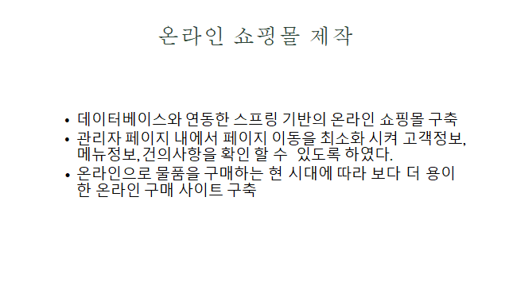

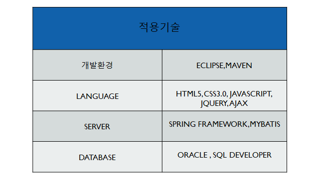

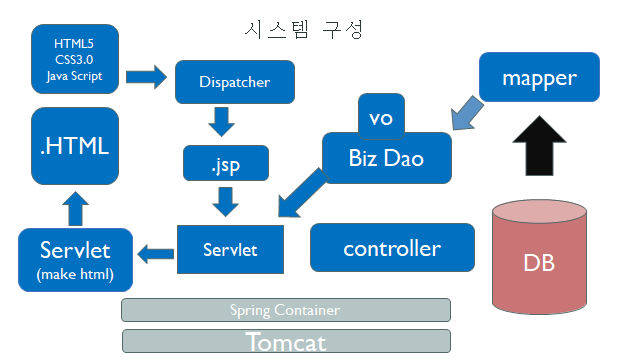
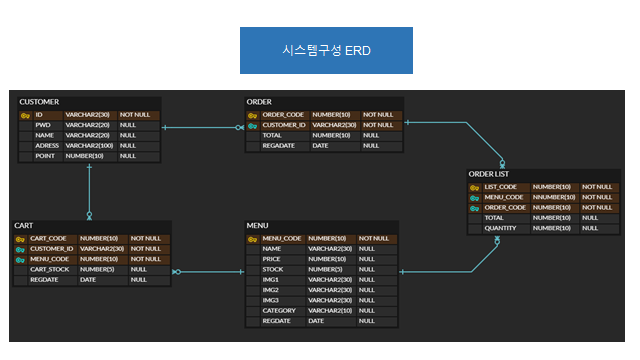

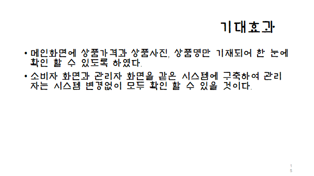

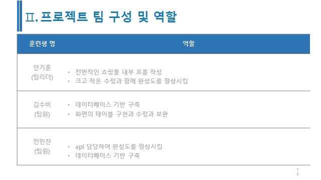

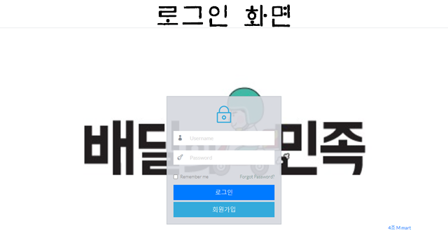

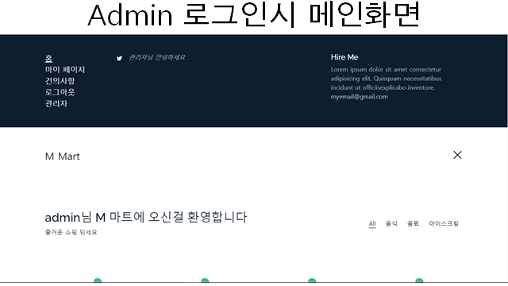

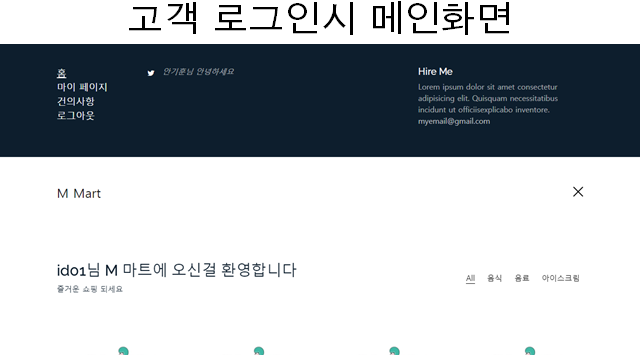

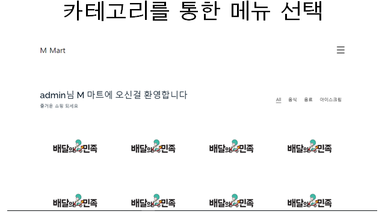

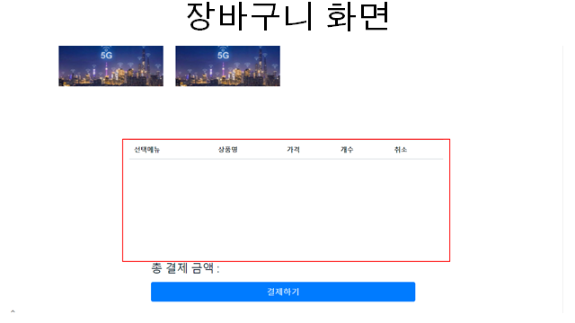

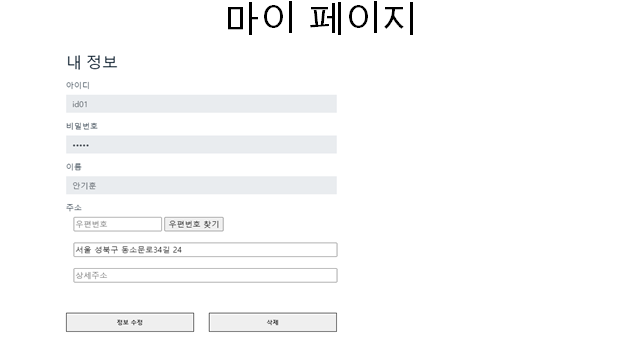

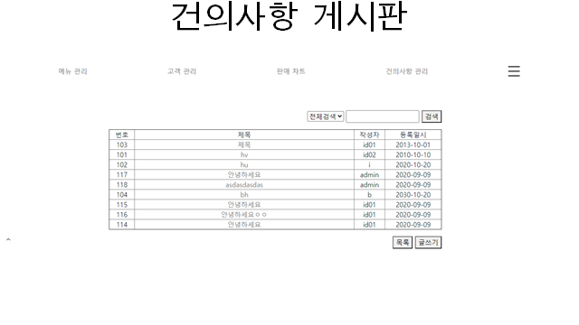

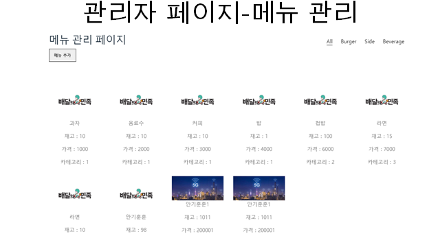

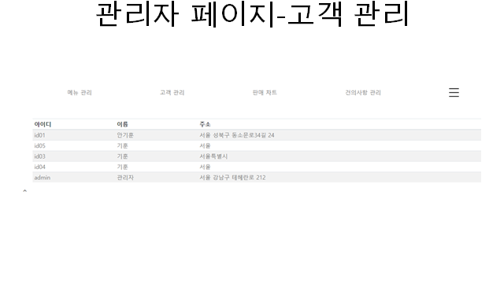

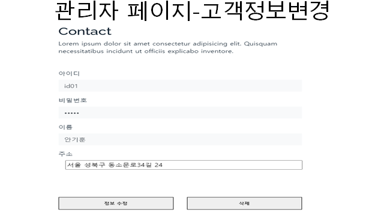

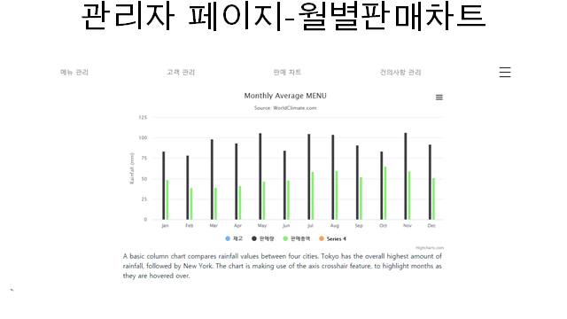

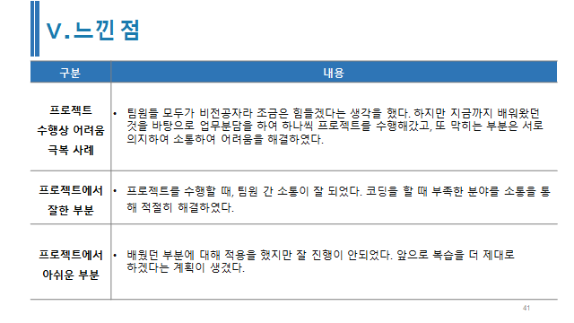

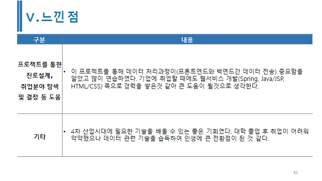

## 부족한 점 (프로젝트 기간이 끝났으니 천천히 고쳐가기)

* 메뉴 검색 기능
* 메뉴 선택 취소 장바구니에서 할때 순서 변하는 문제
* 버튼 오른쪽 특정 위치에 고정
* 배너 색 변경
* 고객 정보에 번호 추가
* mypage -> mypageupdate에서 확인 누르고 mypage로 넘어갈 때 수정된 정보가 넘어가지 않음
* 아이디 rememberme
* 회원가입->중복확인
* 수정, 삭제하시겠습니까? 확인,취소 기능

